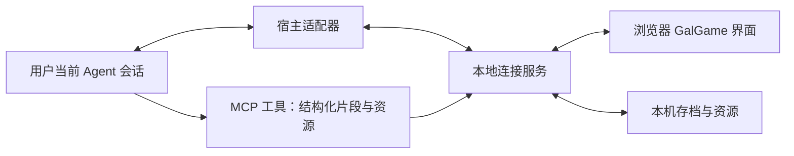

# 不要再做 App 了 · GalGame 对话端开发文档

| 项目 | 内容 |
|---|---|
| 文档版本 | 1.0 |
| 整理日期 | 2026-09-16 |
| 目标版本 | 首个可发布版本 |
| 文档性质 | 产品需求、技术设计、开发任务与验收依据 |
| 设计状态 | 产品行为与首版取舍已确认，常规工程选择按本文默认值及裁量规则执行 |
| 实现状态 | 尚未开发浏览器对话端；当前仓库已有 Skill，不能将其视为已实现本产品 |
| 验证状态 | 已做方案讨论与资料核查；尚未验证任何宿主的原会话双向同步，尚未进行真人试用 |
| 发布原则 | 按实际验证结果逐步增加支持，不要求所有目标 Agent 同时完成 |

本文将已完成的产品讨论整理成可交给开发 AI 执行的规格。正文中的接口、数据表、目录和参数是拟实施设计，不代表仓库已经具备这些能力。同步适配必须先验证，再建设依赖它的完整体验。

## 1. 产品目标与边界

### 1.1 产品定义

将现有“不要再做 App 了”Skill 的创意审查流程，呈现为在电脑浏览器运行的 GalGame。用户与系统、乔布斯、小黑依次对话，将模糊想法整理为可以交给 AI 开发的完整产品方案。

浏览器负责画面、立绘、对话播放、输入和文档阅读。本地连接服务负责传输、校验和保存。模型理解、联网检索、角色内容生成、生图及最终方案生成，继续使用用户当前的 Agent。

### 1.2 目标用户与核心价值

- 已经使用 Agent，拥有一个产品想法，但尚未形成完整设计的人。
- 从创作者的视频或项目分享中发现 Skill，希望通过有趣的问答完成产品策划的人。
- 希望继续使用原 Agent 的会话、记忆和额度，不再搭建一套模型服务的人。

核心结果是形成可执行的产品设计。趣味性来自人物、情绪、问答和节奏；不得为了表演省略审查、代替用户作重要决定或制造无意义关卡。

### 1.3 首版范围

| 包含 | 首版范围外 |
|---|---|
| Windows、macOS 电脑浏览器 | 手机专用界面与跨设备云存档 |
| 当前 Skill 的四阶段审查 | 任意 Skill 的通用前端或通用游戏引擎 |
| 系统、乔布斯、小黑三个人格 | 角色商城、好感度数值、付费解锁或额外剧情系统 |
| 原会话双向同步、结构化剧情展示 | 独立模型账号、浏览器端 API Key 配置或自行托管推理服务 |
| 内置立绘与可选实时生成图片 | 首版强制配音、Live2D 或视频生成 |
| 本机存档、输入草稿、最终文档 | 浏览器内代码编辑器、构建和部署工作台 |
| 返回原 Agent 开始开发 | 方案生成后未经用户操作自动启动开发 |

### 1.4 兼容与发布规则

1. 优先验证 Codex、Claude Code，再逐步扩展国内常用工作助手和编程 Agent。
2. 早期提出的“第一版同时支持两款及国内前五款”已被后续决定更新为逐步发布，不再作为首发数量门槛。
3. 至少一个宿主与操作系统组合通过本文同步及体验验收，才具备首次发布条件。
4. 兼容表按具体应用、桌面端或 CLI 形态、版本、操作系统、测试日期分别记录。
5. 某品牌 CLI 验证成功，不代表它的桌面应用也已支持。支持 MCP 也不等于支持原会话同步。
6. 未验证项标为“待验证”，未达标项标为“实验中”或“不支持”；不得列入正式支持列表。
7. Windows 与 macOS 都是目标平台；只有实测通过的组合才能对外宣称支持。

### 1.5 费用与数据承诺

产品不另收模型费用，不引入新的模型调用账户。聊天、检索、生图和必要的格式修正使用用户原有 Agent 的能力与额度；不能宣传为“不会增加任何消耗”。网页与本地服务不持有模型密钥。

产品不增加自己的云端会话上传服务。原 Agent 原有的云端模型或工具处理仍遵循该 Agent 的设置，不把“网页在本机”宣传成“所有内容都不会出电脑”。

## 2. 已确认决定与实现裁量

| 决定 | 内容 | 来源 |
|---|---|---|
| DEC-01 | 用 GalGame 展示现有 Skill 的问答流程 | 用户明确提出 |
| DEC-02 | 用户自己的原 Agent 执行模型任务，并沿用可用记忆 | 用户明确提出 |
| DEC-03 | 两端逐条同步，通过实测才声明兼容 | 用户明确提出 |
| DEC-04 | 首版不再等待多款应用全部接入，逐步发布 | 用户最后一轮确认 |
| DEC-05 | 系统负责开头和最终交付；乔布斯负责核心设计；小黑负责体验审查 | 用户明确提出 |
| DEC-06 | 立绘、底部姓名与逐字对话、中央输入框、加速与跳过动画 | 用户明确提出 |
| DEC-07 | 非提问片段由点击继续；需要回答时才打开输入框 | 用户明确提出 |
| DEC-08 | 图片模式在开头或设置中选择；不能生图时使用内置图片 | 用户明确提出 |
| DEC-09 | 主界面提供设置与开始游戏；开始后选择存档 | 用户明确提出 |
| DEC-10 | 输入实时保存；断线或等待过久提醒检查原 Agent | 用户明确提出 |
| DEC-11 | 删除网页存档不删除原 Agent 会话；从对应会话重新启动才建立新存档 | 用户明确提出 |
| DEC-12 | 旧历史无法恢复时重新开场，以 Agent 仍可用的记忆为主 | 用户明确提出 |
| DEC-13 | 文档可点击阅读和带走；开发回到原 Agent | 用户明确提出 |
| DEC-14 | 框架、控件、目录、内部命名等常规工程细节由 AI 按约束决定 | 用户授权与前一版方案的实现裁量 |

本文给出的技术栈、存储表名、协议名、等待阈值和输入保存间隔属于工程默认值。开发者可在不改变上述决定的前提下调整，记录原因即可，不需要逐项重新询问用户。改变原会话要求、增加额外付费依赖、上传到新的云服务或改变删除范围，需要重新讨论。

## 3. 用户旅程与页面

### 3.1 完整流程

```text
用户把仓库链接交给自己的 Agent 安装
  → 检查宿主能力并完成对应安装
  → 用户在原会话启动 Skill 的浏览器模式
  → 绑定原会话，打开主界面
  → 开始游戏，选择存档
  → 首次选择图片模式
  → 系统进行创意筛查
  → 乔布斯进行核心设计质询
  → 小黑进行使用体验质询
  → 系统展示设计文档
  → 阅读或下载文档，或返回原 Agent 开发
```

首次启动已绑定的会话自动形成存档卡片；没有存档且尚未绑定时，告诉用户从原 Agent 启动，不在网页里偷偷新建独立模型会话。

### 3.2 页面定义

| 页面 | 主要内容 | 必需操作 | 关键状态 |
|---|---|---|---|
| 主界面 | 产品名称、背景、简短介绍、连接状态 | 开始游戏、设置 | 已连接、未连接、当前宿主不兼容 |
| 存档选择 | 会话标题、Agent、更新时间、阶段、恢复状态 | 进入、删除、返回 | 空列表、可继续、仅可查看、需要重新开场 |
| 设置 | 文本速度、图片模式、必要的状态说明 | 保存、返回 | 实时生图可用或不可用 |
| 对话场景 | 立绘、姓名、正文、等待或连接状态 | 加速、跳过当前动画、点击继续、输入回复、返回主界面 | 播放、等待点击、等待输入、生成、故障 |
| 完成场景 | 系统简短说明、文档卡片 | 打开文档、下载 Markdown、返回原 Agent 开始开发 | 文档就绪、文档读取失败 |
| 文档阅读 | 完整方案、目录和版本 | 阅读、下载、返回 | 正常、读取失败 |

已有历史允许从对话场景查看，但不改变当前未完成问题和播放进度。浏览器宽度不足时保持正文与输入可访问；缩放和适配不得让按钮遮住台词。

### 3.3 安装与启动体验

- 共用一套核心程序，为不同宿主提供对应插件清单或 Skill、MCP 配置与启动组件。
- 优先由用户自己的 Agent 完成安装；需要宿主重启、登录或权限操作时，给出该应用对应的操作说明。
- 浏览器不要求用户重新选择模型、填写模型 API Key 或注册作者提供的新账户。
- 不兼容时说明失败能力及当前支持列表，保留原 Skill 的常规使用方式。
- 卸载连接组件不擅自删除用户的原 Agent 会话；本机产品数据的清理必须明确说明范围。

## 4. 人格、剧情和视觉规则

### 4.1 人格职责

| 人格 | 关注点 | 语言与行为 |
|---|---|---|
| 系统 | 流程、证据、状态、最终文档 | 清楚直接，开头了解想法，结尾整理可执行方案 |
| 乔布斯 | 产品目的、核心价值、对象、取舍、完整体验 | 有独立判断，敢于质疑，指出思考方向；用户求助时才给有限建议 |
| 小黑 | 真实使用中的理解、操作、等待、错误、恢复与退出 | 直白、尖锐、有情绪；只提出问题与要求，不给解决方案或暗藏答案的选择题 |

沿用现有 Skill 的角色及资料依据。角色阶段的正式台词显示姓名。通常每轮 1–3 个相关问题，不为凑数量增加问题。用户的有效反驳和明确委托应被接受，不能为了表演无限追问。

人物情绪要跟随用户答案变化。已经解释清楚的问题不反复刁难；“好”“可以”也不能自动填补尚未回答的重要决定。

### 4.2 播放规则

1. 当前角色立绘位于主体画面，底部显示姓名和逐字正文。
2. 默认约 30 字/秒，设置可调节并可关闭逐字效果；按 Unicode 字素处理，避免拆开 emoji 或组合字符。
3. 加速只改变显示速度；跳过只立即显示当前片段的完整文字。
4. 打字过程中点击正文区域，先显示当前片段全文；完成后再次点击才进入下个无需回答的片段。
5. 所有要求用户回答的片段必须播放完成，才显示中央自由输入框。
6. 输入框、选中文本、设置控件等交互不能误触剧情前进。
7. 用户提交成功后显示“你说：……”并逐字展示原输入。首版保留当前角色立绘，切换对话框姓名。
8. 长回复按完整自然段拆成多个片段，不改写或遗漏内容。最终文档单独阅读，不逐字播放全文。
9. 可提供键盘等价操作；中文输入法组合输入期间不触发发送或剧情前进。

### 4.3 必须保留的角色交接

乔布斯转小黑：

```text
乔布斯回应用户最后的答案
  → 乔布斯说明已理解核心设计，并介绍小黑
  → 用户点击继续
  → 小黑立绘与承接台词
  → 小黑提出使用问题
  → 出现输入框
```

小黑转系统：

```text
小黑回应最后答案，确认要求已说明白并告别
  → 用户点击继续
  → 系统简短说明方案已生成
  → 展示文档卡片与操作选项
```

交接台词及对应图片属于正式交付。两端都必须能看到完整内容，不能只存在于思考、过程消息或工具日志。不得先宣布过关，再在最终文档突然提出此前本应解决的重要产品问题。

### 4.4 图片模式

- **内置立绘：**默认模式，使用随包资源，不调用生图。为各角色提供正常、思考、疑惑、不满、认可等必要状态。
- **实时生成：**用户明确开启后，使用当前 Agent 已有的生图能力。普通角色回合一张；乔布斯转小黑分别生成各自的图片。
- 开始时或设置中选择模式，并说明等待和额度影响；已明确选择后不在每轮重新征求同意。
- 无能力、额度不足或图片失败时回退内置图；可以在文字中加入简短括号反应。失败后暂停本次会话自动生图，用户重新开启时再检测。
- 图片关联到具体片段；迟到图片只更新所属片段或历史，不切换当前人物。文字已经可用时允许先用内置图播放，不能无限等待图片。
- 结论视觉沿用现有 Skill：停止建议对应掌心“别做了”；继续建议对应竖拇指上方一个红色“中”字，无感叹号。内置模式使用随包结论图，实时模式按能力生成，不另开一轮图片确认。
- 角色身份、画风和场景保持连续，表情与动作体现当轮反应。内置资源由项目自行制作或使用有明确使用许可的素材。

### 4.5 等待与连接状态

| 条件 | 表现 | 后续行为 |
|---|---|---|
| Agent 正常生成 | 当前角色思考立绘与轮换短句 | 等待真实事件，不显示虚假进度百分比 |
| 约 60 秒没有生成进展 | “等待较久，可以查看原 Agent” | 保持当前任务，不重发 |
| 约 3 分钟没有进展 | 持续保留检查原 Agent 的入口 | 允许用户等待或离开页面，不擅自宣告任务失败 |
| 原 Agent 等待授权或登录 | 明确提示回原应用处理 | 恢复后继续原回合 |
| 已确认断线 | 显示断线，停止思考状态 | 暂停发送、保留草稿、允许重连 |

连接心跳与生成进展使用独立计时。默认连接心跳间隔 5 秒，连续 3 次失败后标为断线；收到明确关闭事件时立即标记。具体参数可按实测调整，但不能靠假装思考掩盖已知断线。

## 5. 功能需求

| ID | 功能及前置条件 | 正常行为 | 异常与恢复 | 验收依据 |
|---|---|---|---|---|
| FR-01 | 启动与绑定；宿主已安装组件 | 在当前原会话创建受控绑定，打开网页并显示绑定对象 | 不支持或无连接时说明原因，不误连其他会话 | AT-01 |
| FR-02 | 双向同步；绑定有效 | 两端消息进入同一个原会话，正文、顺序和资源关联一致 | 去重、断线补齐、核对不确定提交 | AT-02、AT-03、AT-04 |
| FR-03 | 剧情播放；片段已校验 | 逐字显示、加速、跳过当前动画、点击继续及输入回复 | 超长内容分页；跳过不越过必答问题 | AT-05 |
| FR-04 | 角色交接；前一阶段设计条件已满足 | 按指定顺序显示两位角色的全部片段及图片 | 不丢收尾、不提前开输入框，格式错误不猜角色 | AT-06 |
| FR-05 | 配图与等待；已知能力及用户选择 | 内置图或实时生成、真实状态提示 | 生图回退、授权等待、连接异常分别处理 | AT-07 |
| FR-06 | 草稿与恢复；本机存储可写 | 保存草稿、播放位置及阶段，重开恢复 | 存储失败可见；无历史时重新开场 | AT-08、AT-09 |
| FR-07 | 删除边界；用户选择目标存档 | 删除网页存档及专属本地数据，保留原 Agent 会话 | 不因自动发现历史而重建已删除存档 | AT-10 |
| FR-08 | 文档交付；方案完成 | 可点击阅读并下载同一版本 Markdown，原 Agent 可访问 | 读取失败可重试，不显示虚假成功或不完整文档 | AT-11 |
| FR-09 | 返回开发；用户主动选择 | 返回对应原 Agent 会话，带上已交付文档与用户的执行意图 | 无直达能力时提供准确返回说明及可复制指令，不显示已开始执行 | AT-11 |
| FR-10 | 兼容声明；测试记录齐备 | 只发布验证通过的应用形态、版本和系统组合 | 更新破坏兼容时撤回该组合的支持标记并说明限制 | AT-12 |

## 6. 总体技术设计

### 6.1 组成与职责



| 模块 | 职责 | 不承担的职责 |
|---|---|---|
| 现有 Skill | 审查逻辑、人物要求、阶段准入、最终文档、结构化输出约定 | 不以提示词代替宿主权限或同步接口 |
| 宿主适配器 | 绑定原会话、提交用户消息、订阅正式回复与状态、定位原应用 | 不私建模型会话冒充同步，不直接改宿主会话数据库 |
| MCP 工具层 | 接收已约定的剧情、图片与文档数据，返回校验结果 | 工具结果不视为原应用中的正式用户消息 |
| 本地连接服务 | 校验、事件排序、去重、状态机、资源服务与本机持久化 | 不提供独立推理，不接受网页任意命令执行 |
| 浏览器 | 剧情播放、输入、设置、存档选择、文档阅读 | 不负责决定产品过关，不自行生成另一份角色回答 |

### 6.2 工程默认值

- 统一 TypeScript 工程；网页前端优先 React 与 Vite，本地服务使用 Node.js 当前受支持的 LTS 版本。
- 使用 SQLite 保存本机状态；资源使用受控本地目录。浏览器即时草稿缓存可用 IndexedDB。
- 网页静态资源、HTTP 接口和 WebSocket 使用同一本地服务，减少跨域和端口配置。
- 安装端为宿主选择实际支持的 MCP 传输，不假定所有宿主具有同样的协议版本和工具能力。
- 开发时核对工具链官方文档并锁定依赖版本；沿用已有兼容实现优先于重复搭建。
- 运行时不依赖作者电脑路径，按操作系统应用数据目录定位存档与资源。

### 6.3 拟实施目录

以下目录是建设建议，当前并未创建：

```text
apps/web/                   # 浏览器界面
packages/bridge/            # 本地 HTTP/WS、状态与持久化
packages/protocol/          # 版本化协议、校验及共享类型
packages/adapters/          # 各宿主适配器与能力探测
packages/mcp/               # MCP 工具入口
assets/characters/          # 内置角色状态资源
assets/verdicts/            # 筛查结论资源
packaging/                  # 各宿主安装清单与启动入口
tests/                      # 必需的协议、恢复与适配验收
docs/                       # 开发文档、兼容报告与安装说明
skills/dont-build-an-app/   # 已有 Skill，保留常规文字使用能力
```

## 7. 宿主适配与同步契约

### 7.1 正式支持的必要条件

1. 网页绑定启动 Skill 时的同一个原会话，能证明会话标识和上下文归属一致。
2. 网页提交的用户消息出现在原会话正常对话记录中。
3. 用户在原会话输入的消息可以进入网页。
4. 正式助手回复、人物归属、段落顺序、图片与文档的对应关系一致。宿主不支持行内显示某种附件时，须有正常正文中的可访问附件引用，并在兼容表说明呈现差异。
5. 不同步隐藏推理；过程消息和工具日志可以用于诊断，不能代替正式角色正文。
6. 重连补齐、去重和并发输入测试通过。

### 7.2 接口能力模型

适配器内部至少提供下列逻辑能力；名称是项目内接口设计，不是某宿主已经存在的 API：

| 能力 | 输入与输出 | 判定要求 |
|---|---|---|
| `probeCapabilities` | 宿主版本与环境 → 能力报告 | 分开报告 MCP、会话读取、原会话提交、事件订阅、图片、定位原应用 |
| `bindCurrentConversation` | 当前宿主提供的会话上下文 → 可信绑定 | 会话 ID 来自宿主，不采信模型随意填写的 ID |
| `subscribeConversation` | 绑定与事件游标 → 新消息和状态事件 | 能区分正式回复、过程、工具结果和异常 |
| `submitUserMessage` | 绑定、客户端消息 ID、所答问题、文本 → 提交状态与宿主消息 ID | 能核实实际入库，不把工具返回字符串当作用户消息 |
| `readSince` | 绑定、最后确认游标 → 可访问的新消息 | 如宿主缺少接口，必须证明其他稳定订阅及核对机制满足恢复验收 |
| `reconcileSubmission` | 客户端消息 ID及绑定 → 已确认、未提交或未知 | 处理确认丢失，不盲目重试 |
| `openOriginalConversation` | 绑定 → 定位结果或具体返回说明 | 不伪报窗口已经打开 |

优先使用宿主公开支持的 API、扩展或会话接口。不得仅凭 SDK 支持 `resume` 就认定它能接管正在运行的原窗口；必须验证真实实例和并发关系。

### 7.3 消息路径与一致性

**用户输入：**网页生成唯一 `client_message_id` → 本地保存待提交记录 → 适配器向原会话提交 → 得到宿主确认 → 标记已发送并播放用户台词。发送中不清空唯一的草稿副本。

**Agent 回复：**Agent 通过 MCP 暂存结构化片段 → 校验通过 → 在原会话发布同一份内容的正式回复 → 适配器观察并核对正文及资源引用 → 本地确认该回合 → 网页播放。

能由宿主保证单一内容源的适配器可省去重复暂存步骤，但必须保持原应用和网页的一致性。两端不得分别调用模型生成答案。

正文核对使用按顺序连接的姓名和片段文本；只允许协议规定的换行与展示格式归一化，不使用模糊相似度接受漏句或错角色。文档和图片用版本、资源 ID 或哈希核对。

正文不一致时保持“显示未确认”状态，保留实际收到的原文及诊断，提示返回原 Agent；不得把不一致的内容标记为同步完成。

### 7.4 并发与去重

- 每个会话同一时间只允许一个正在提交的用户回合；双击发送不生成第二条消息。
- 原 Agent 收到另一端的新消息时，网页保留草稿并更新上下文；若所答问题已失效，提示用户查看最新问题后再发送。
- 提交确认丢失时先核对宿主历史或消息标识。结果仍未知时显示“发送结果待核对”，不自动重复发送。
- 每个宿主消息 ID 和桥接事件 ID只能入库一次；消息顺序以宿主可核实顺序为准，不以网页收到时间随意重排。
- 同一存档多标签页同时打开时，只允许一个活动发送端，其他页面只读或明确切换活动端。

## 8. 结构化剧情协议

### 8.1 回合与片段

一轮正式回复可以包含多个角色片段。会话 ID 由桥接层绑定；模型仅提交本次可信调用上下文允许的内容。协议必须版本化，无法识别的主要版本不得静默解析。

下面是乔布斯转小黑的示例，台词仅用于说明数据结构：

```json
{
  "schema_version": "1.0",
  "session_id": "session_demo",
  "turn_id": "turn_12",
  "host_message_id": "host_message_48",
  "segments": [
    {
      "segment_id": "turn_12_01",
      "speaker": "jobs",
      "text": "核心目的和使用过程已经说明白了。接下来请我们的用户代表：小黑和你聊一聊。",
      "emotion": "approval",
      "asset_id": "builtin_jobs_approval",
      "advance": "click",
      "reply_to": null,
      "document_id": null
    },
    {
      "segment_id": "turn_12_02",
      "speaker": "xiaohei",
      "text": "你们刚才的对话我都看到了。我想知道，做到一半关掉网页，我已经写的内容还在吗？",
      "emotion": "skeptical",
      "asset_id": "builtin_xiaohei_skeptical",
      "advance": "reply",
      "reply_to": null,
      "document_id": null
    }
  ]
}
```

`host_message_id` 由适配器在正式回复确认后补齐，不要求模型编造。示例中的 ID 均为示意值。

### 8.2 字段规则

| 字段 | 类型与规则 |
|---|---|
| `schema_version` | 受支持的协议版本字符串 |
| `session_id` | 本地可信会话绑定，不允许模型跨会话指定目标 |
| `turn_id` | 本会话内唯一；同一回合重传保持一致 |
| `host_message_id` | 宿主确认后填写；未确认数据不能作为已同步回复播放 |
| `segment_id` | 回合内唯一并稳定，用于播放、回复定位和图片绑定 |
| `speaker` | `system`、`jobs`、`xiaohei`、`user` 四选一 |
| `text` | 正式可见文本；普通剧情必须非空；姓名由界面统一显示，避免重复前缀 |
| `emotion` | 随资源清单定义的状态；未知状态回退同一角色的默认状态 |
| `asset_id` | 受控资源 ID，可为空；禁止直接把任意路径当资源读取 |
| `advance` | `click`：点击继续；`reply`：等待回复；`complete`：完成并展示文档 |
| `reply_to` | 用户消息指向正在回答的 `segment_id`，其他情况为空 |
| `document_id` | 完成片段关联已保存的文档版本，普通片段为空 |

一个等待用户输入的回合，只能在末尾出现一个 `reply` 片段；2–3 个相关问题可以写在该片段内。后续台词不能绕过用户回答继续播放。`complete` 必须关联完整文档，不能只给一条“已生成”提示。

### 8.3 校验与错误

- 校验必填字段、枚举、ID 唯一性、片段顺序、等待位置、资源所属角色和文档存在性。
- 先验证结构，再提交正式内容。最多允许一次自动格式修正；只修正格式，不改动已确认的产品决定。
- 仍失败时显示协议错误及返回原 Agent 的入口，不用正则猜测谁在说话，也不无限重试。
- 由协议控制布局、顺序和按钮，由 Skill 控制角色思想和提问要求；不能承诺协议能消除所有模型的语义质量差异。

### 8.4 实时事件

桥接到网页的事件使用统一信封：`event_id / session_id / sequence / type / payload`。`sequence` 是本地持久化后的单调序号，重连通过最后确认序号补齐。

事件类型至少包括 `connection_changed`、`submission_changed`、`turn_committed`、`asset_ready`、`document_ready`、`draft_saved`、`host_action_required` 和 `error`。网页收到重复 `event_id` 不重复播放。服务确认持久化后才发送成功状态。

## 9. 状态机

连接状态与播放状态分开，避免把“模型慢”“正在读旧消息”和“断线”混为一谈。

| 状态 | 进入条件 | 允许动作 | 离开条件 |
|---|---|---|---|
| `disconnected` | 无绑定或连接断开 | 查看本地内容、编辑草稿、重连 | 连接与绑定验证成功 |
| `syncing` | 正在核对历史或提交结果 | 查看已确认内容、保留草稿 | 同步完成或显示可理解的失败 |
| `playing` | 已确认片段开始显示 | 加速、立即显示全文 | 当前文本播放完成 |
| `awaiting_continue` | 当前片段无需回答 | 点击继续、回看历史 | 用户继续 |
| `awaiting_reply` | 提问片段显示完成 | 输入、保存草稿、发送 | 用户发送且取得提交锁 |
| `submitting` | 消息正在交给原 Agent | 保留输入，查看发送状态 | 原会话确认、明确失败或待核对 |
| `agent_working` | 用户消息已确认，Agent 正在执行 | 查看等待状态、检查原 Agent | 正式回复确认、需用户操作或断线 |
| `host_action_required` | Agent 等待权限或登录等 | 返回原 Agent 处理 | 宿主确认恢复 |
| `display_error` | 结构或正文一致性不成立 | 查看说明、返回原 Agent | 获取已核实的修正结果 |
| `completed` | 方案文档完整就绪 | 阅读、下载、返回开发 | 用户离开或启动明确的新一轮修改 |

用户关闭网页只停止显示，不推定原 Agent 已停止执行。重新打开时先恢复和核对，再决定当前应该显示的状态。

## 10. 数据、保存与删除

### 10.1 本机数据模型

| 数据 | 核心字段 | 用途与保留 |
|---|---|---|
| `sessions` | `id`、宿主类型及实例标识、原会话 ID、标题、阶段、最后宿主游标、本地事件游标、播放位置、协议版本 | 存档入口与恢复；用户删除前保留 |
| `events` | `event_id`、`session_id`、序号、类型、宿主消息 ID、回合 ID、载荷、确认状态 | 已确认消息、待提交记录及恢复依据；随所属存档删除 |
| `drafts` | `session_id`、所答片段、文本、修订号、保存时间、是否已提交 | 每个存档的最新草稿；提交确认或用户清空后更新 |
| `assets` | 资源 ID、角色、来源、所属片段、相对存储位置、哈希、状态、引用关系 | 内置资源和本机生成图副本；不直接保存任意可执行路径 |
| `documents` | 文档 ID、存档 ID、版本、Markdown 内容、哈希、宿主引用、创建时间 | 确保阅读、下载和原 Agent 使用同一版本 |
| `preferences` | 文本速度、图片模式等 | 本机设置；单个存档删除不清除全局设置 |

对 `(session_id, host_message_id)` 和客户端消息 ID 建立适当唯一约束。写入事件、更新游标及确认状态应使用事务，避免恢复后消息重复或跳过。

### 10.2 草稿

输入时持续更新浏览器缓存，并以短间隔写入本地服务；默认持久化防抖不超过 300 毫秒，在失焦或离开场景时尽快提交。不能只依赖 `beforeunload`。

“已保存”必须对应持久化成功的修订号。失败时明确提示并保留可复制文本。刷新或崩溃后只承诺恢复最后一次确认保存成功的版本，不声称可以保证恢复尚未落盘的每个字符。

以本地服务存储为跨次启动的主要依据，不依赖随机端口变化后仍能读取旧网页 origin 的浏览器缓存。

### 10.3 恢复规则

1. 选择存档后检查宿主及原会话是否可连接。
2. 恢复本地已确认片段、播放位置及草稿，再同步可访问的新内容。
3. 原会话是正式对话事实来源，本机存档是视觉播放和草稿来源，两者不得互相伪造缺失内容。
4. 原 Agent 未连接时允许阅读已保存内容，暂停发送。
5. 旧历史无法恢复时明确提示重新开场，以 Agent 当前仍保留的记忆继续；不宣称完整读档。
6. 记忆不足时由 Agent 说明缺少什么，并只补问影响继续的必要问题，不编造旧决定。

### 10.4 删除规则

- 删除前用简短说明标明：删除此网页存档、草稿和专属缓存，不删除原 Agent 会话。
- 删除产品拥有且只被该存档引用的数据；共享内置资源保留，原 Agent 的原始图片和文件不删除。
- 用户已经下载到其他位置的文档不随存档删除。
- 不扫描全部宿主历史来自动重建被删存档。后台迟到事件不能复活已删除会话；关闭订阅并使用会话失效标记拒收。
- 用户以后从同一原会话主动重新启动时建立新的网页存档；能否恢复旧内容由适配能力决定，不能恢复就按重新开场处理。

### 10.5 本地访问边界

服务默认仅监听本机回环地址。页面通过启动配对获得会话访问权限，校验 Origin 和会话授权。网页只访问显式绑定过的会话，不枚举全部私人聊天。模型文本和文档经过安全渲染，不执行其中的 HTML 脚本或命令。

日志记录必要的状态和诊断，默认避免保存密钥、完整私人会话副本或敏感输入。故障报告由用户选择分享，不自动上传。

## 11. 最终文档与返回开发

系统完成提示保持简短，展示文档卡片和三个主要操作：

- **打开设计方案：**进入完整阅读视图。
- **下载 Markdown：**保存可以发给其他 AI 或开发者的完整文档。
- **返回原 Agent 开始开发：**用户主动表达执行意图后，定位到绑定会话并传递对应文档版本；无法直接定位或传递时给出准确返回说明和可复制指令。

是否能拖入某个应用由宿主决定；首版保证可下载并在支持的接收方式中使用，不强行承诺所有应用都接受网页直接拖拽。

生成的产品文档应包括目标用户、核心价值、首版范围、完整流程、页面与状态、稳定功能 ID、异常处理、数据与费用边界、实现裁量、验收条件和开发顺序。关键产品决定在角色问答中闭合；必须实测的事实转为验证任务，不能伪装成已经通过。

## 12. 验收计划

以下均为待执行验收。当前没有任何用例被标记为通过。

| ID | 场景与操作 | 通过标准 | 未通过处理 |
|---|---|---|---|
| AT-01 | 从两个不同原会话分别启动网页 | 会话身份清楚，各自输入与资源互不串联 | 修复绑定，不发布该适配器 |
| AT-02 | 在网页和原 Agent 交替进行至少 10 轮真实输入 | 两端逐条用户消息、正式回复、顺序一致；会话 ID 不变 | 记录缺失能力，保持未支持 |
| AT-03 | 发送前、发送后未确认、确认后三个时点断线并恢复 | 已确认消息无丢失与重复；未知提交先核对；草稿可见 | 修复幂等与恢复逻辑 |
| AT-04 | 两端接近同时发送、连续点击发送、同存档双标签页发送 | 不生成重复回合，不把旧问题草稿静默发给新问题 | 修复锁定与上下文检查 |
| AT-05 | 逐字播放、加速、跳过、长文本、键盘及中文输入法 | 内容完整，输入不会误发送；必答问题不会被跳过 | 修复播放器和输入处理 |
| AT-06 | 完成乔布斯转小黑、小黑转系统各一次 | 全部收尾、登场、提问及图片归属正确；原 Agent 正文同样完整 | 修复协议或正式正文映射 |
| AT-07 | 切换图片模式，模拟生图失败、迟到图片、Agent 授权等待与断线 | 内置模式不生图；故障回退正确；不错误换角色或伪装思考 | 修复能力检测与状态反馈 |
| AT-08 | 输入并看到已保存后刷新、关闭重开，测试存储失败 | 恢复确认保存的草稿；失败可见；不依赖关页瞬间写入 | 修复持久化 |
| AT-09 | Agent 执行时关页，之后恢复；再测试无历史读取能力 | 已完成回复补齐；无法恢复时明确重新开场，不虚构历史 | 修复恢复规则或下调兼容声明 |
| AT-10 | 删除存档并在后台送达迟到事件，再从原会话重新启动 | 原会话不变；删除项不自动复活；主动启动创建新存档 | 修复删除及订阅生命周期 |
| AT-11 | 完成文档后阅读、下载、返回原 Agent | 三处文档内容和版本一致；仅阅读不会启动开发 | 修复交付与执行入口 |
| AT-12 | 对每个拟发布宿主和系统组合进行安装及上述适用验收 | 有可复现安装步骤、版本与日期、实际结果，无核心阻塞 | 不声明该组合已支持 |
| AT-13 | 提交缺字段、重复片段、错角色资源、非法等待位置或正文不一致 | 校验阻止错误播放；最多一次格式修正；错误可追踪 | 修复协议验证 |
| AT-14 | 邀请约 5 位目标用户，用自己的创意完成流程 | 无需作者持续指导即可完成；无核心理解或恢复阻塞；能说明文档如何使用 | 按具体阻塞修正相关体验并复测 |

真人试用记录：是否知道谁在说话、何时回答；是否误解跳过；等待及恢复是否清楚；人物是否有区别且有助于用户自己作决定；最终方案是否足以交给未参与对话的开发者。角色满意只代表模拟预审，不替代这些测试。

除核心契约、持久化和适配风险外，不为普通样式改动建立重复实现细节的测试。已有检查通过后，只有新改动、失败或未解疑点才扩大或重跑。

## 13. 开发任务与里程碑

| 任务 | 实施内容 | 依赖 | 交付物 | 完成标准 |
|---|---|---|---|---|
| DEV-01 | 核对仓库、宿主版本与公开接口，建立能力探测和最小原会话同步验证器 | 实际宿主环境与用户现有会话能力 | 极简网页、适配代码、能力报告和真实消息对照记录 | 至少一个组合通过 AT-01 至 AT-04 的核心同步要求 |
| DEV-02 | 实现版本化协议、MCP 数据接收、正式正文核对与事件队列 | DEV-01 | 协议定义、校验器、真实角色交接闭环 | AT-06、AT-13 通过 |
| DEV-03 | 实现主界面、存档选择、逐字播放器、输入、设置、内置资源及实时图片接入 | DEV-02 | 可用 GalGame 界面与对应资源 | AT-05、AT-07 通过 |
| DEV-04 | 实现本机存储、草稿、删除、恢复与故障状态 | DEV-02；可与已稳定接口上的界面开发交错推进 | 持久化与故障恢复功能 | AT-03、AT-04、AT-08 至 AT-10 通过 |
| DEV-05 | 实现设计文档版本、阅读、下载、返回开发 | DEV-02、DEV-03、DEV-04 | 完整创意到文档的可执行流程 | AT-11 通过 |
| DEV-06 | 宿主打包、安装说明、兼容报告及真人试用 | DEV-01 至 DEV-05 | 安装包或插件清单、安装文档、测试记录 | AT-12、AT-14 通过后发布对应组合 |
| DEV-07 | 扩展下一款 Agent | 已稳定的核心及该宿主环境 | 新适配器与独立兼容报告 | 重复全部适用验收后增加支持项 |

实现仓库应保留以下开发交付记录：能力矩阵、协议说明、兼容报告、安装与卸载说明、验收结果和已知限制。测试报告要区分模拟测试、真实宿主测试、浏览器测试与真人试用。

如果一个候选宿主不支持可靠同步，记录具体失败能力并验证下一候选。如果所有候选均不满足，暂停正式发布并提交证据；可以保留明确标注的界面演示，但不能把模拟同步称为可用产品。不得通过另起独立模型会话、仅保存工具日志或伪造原窗口消息来凑验收。

## 14. 真实风险与执行依赖

| 项目 | 已定处理边界 | 待验证事实或执行输入 | 取得时机与失败处理 |
|---|---|---|---|
| 原会话接入 | 必须满足双向同步契约 | 宿主接口能否操作当前实例，是否允许稳定订阅与提交 | DEV-01 优先验证；失败不声明支持 |
| Windows/macOS | 均为目标，按实测组合发布 | 对应测试设备及实际宿主版本 | 发布对应组合前取得，缺设备时标未验证 |
| 用户登录与权限 | 继续使用用户原 Agent | 宿主可能要求登录、授权、重启或重新启用工具 | 在实际阻塞节点给具体说明，不提前索取无关密钥 |
| 生图能力 | 可选，失败有内置资源 | 每个宿主可调用的生图及图片读取方式 | 能力探测与 AT-07；不能用时回退 |
| 人物质量 | 保留独立立场与职责 | 不同模型对角色和格式的遵循程度 | DEV-02 后真实问答及 AT-14；修正 Skill 与格式约束，不保证完全一致 |
| 旧历史读取 | 不能恢复时重新开场 | 宿主是否提供历史与附件访问 | 恢复测试时核对，不编造旧内容 |
| 等待与额度 | 显示真实状态，使用原额度 | 实际生成耗时、额度不足表现 | 用真实运行调整阈值，不编造固定耗时或成本 |
| 宿主版本变化 | 兼容声明有具体版本 | 更新是否破坏接口 | 新版本抽查核心契约，破坏时撤回受影响标记 |

这些是实施验证和资源依赖，不是留到开发阶段重新询问的既有产品选择。

## 15. 依据与资料边界

### 15.1 仓库内依据

- [Skill 入口](../skills/dont-build-an-app/SKILL.md)：四阶段流程、角色交接及正式正文要求。
- [设计闭合规则](../skills/dont-build-an-app/references/decision-closure.md)：区分用户决定、工程裁量、待实测事实和执行依赖。
- [产品文档要求](../skills/dont-build-an-app/references/product-design-document.md)：方案内容、验收与开发交接。
- [角色反应规则](../skills/dont-build-an-app/references/character-reactions.md)：角色身份、图片与收尾顺序。
- [人物资料](../skills/dont-build-an-app/references/persona-sources.md)：现有人格设计参考。

本文是浏览器模式的开发规格。现有 Skill 的普通对话模式继续可用；网页自动存档、内置立绘等新增行为按本文实现，不能声称现有 Skill 已经自动具备。

### 15.2 方案讨论中查阅的外部资料

以下链接用于解释研究依据；将方案整理成本文不代表重新测试了这些接口或其当前兼容性。实施时需核对官方现状。

| 资料 | 对本方案的作用 | 不能据此声称 |
|---|---|---|
| [Codex App Server](https://developers.openai.com/codex/app-server/) | 会话、回合及事件接口是适配研究入口 | 任意新启动的服务都能安全操作当前桌面会话 |
| [Claude Code Remote Control](https://code.claude.com/docs/en/remote-control) | 官方跨界面延续会话案例 | 第三方浏览器 UI 已获得同样接入能力 |
| [MCP 工具规范](https://modelcontextprotocol.io/specification/2025-11-25/server/tools) | 结构化工具传递与校验依据 | MCP 自动授予原会话读取、写入和唤醒能力 |
| [MCP Feedback Enhanced](https://github.com/Minidoracat/mcp-feedback-enhanced) | 网页收集输入并经 MCP 返回 Agent 的参考 | 工具返回内容等同于宿主正式用户消息 |
| [EverOtome](https://github.com/aveluneverse/EverOtome) | 视觉小说式 AI 对话界面参考 | 该项目已实现本文的产品审查及多宿主原会话同步 |
| [QoderWork Connectors](https://docs.qoder.com/qoderwork/connectors) | MCP 连接能力的宿主参考 | 原会话逐条双向同步已经验证 |
| [MDN localStorage](https://developer.mozilla.org/en-US/docs/Web/API/Window/localStorage) | 浏览器持久化的机制与限制参考 | 任何环境、origin 或隐私模式下都能永久保存草稿 |

同类产品已经覆盖视觉小说聊天界面或 MCP 网页反馈等组成部分。本项目的差异重点是创意审查流程、角色交接、原 Agent 会话同步及完整方案交付的组合。本次可访问资料不能证明全球原创性，也不能代替真实需求验证。

## 16. 给接手开发 AI 的执行指令

> 按本文实现“不要再做 App 了 · GalGame 对话端”。先检查现有项目与宿主工具，保留现有 Skill 的常规用法及审查流程。
>
> 第一个任务是 DEV-01：完成 FR-01、FR-02 的真实原会话同步验证器。交付极简网页、宿主适配代码、会话身份依据和两端消息对照记录。验证两端交替发言、断线恢复、不确定提交及重复输入；模拟结果不能替代真实宿主验收。
>
> 优先验证 Codex、Claude Code，按实测结果逐步发布。若某宿主不能满足契约，记录限制并验证其他候选，不另外创建独立模型会话冒充同步。所有候选都失败时报告证据并暂停正式发布。
>
> 同步成立后按 DEV-02 至 DEV-06 完成协议、GalGame 界面、图片回退、存档、文档和安装。按 FR 与 AT 编号维护交付及测试记录。
>
> 常规实现按本文默认值和裁量规则自主决定，不重复询问已经明确的产品问题。不得增加新的模型服务、浏览器 API Key 配置、云端会话上传或额外付费依赖。出现实质改变产品的新冲突时，说明影响并与用户敲定。
>
> 完成后交付可运行的实现、安装说明、实际兼容列表、验收记录和已知限制。分别报告文件完成、构建通过、浏览器通过、真实宿主通过及真人试用情况，不把文档或工具执行成功等同于产品验收。
