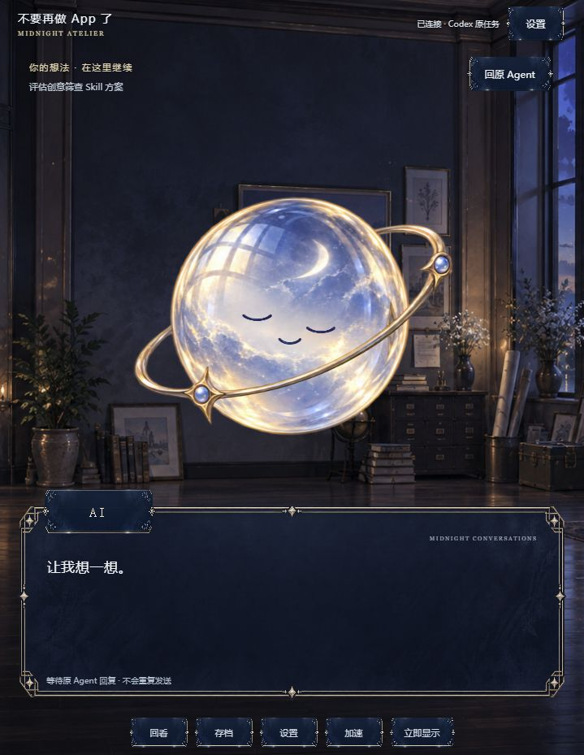

# 系统精灵 Live2D 实测

## 已实现

- Cubism Editor 5.1.03 组件导出的自有精灵模型，7 个 ArtMesh，27 个默认参数；实际绑定眼球 X/Y、双眼开合、嘴部开合与呼吸。导出 `.moc3` 为 27,456 字节。
- 官方 Cubism SDK for Web 5-r.5 / Core 6.0.1 / Framework WebGL renderer。不是用 PNG 整图动效冒充 Live2D。
- 主菜单和内置系统角色使用模型；鼠标视线有平滑跟随，自动眨眼、±4px 漂浮和微弱呼吸；点击交替开心/惊讶，1.2秒恢复，重复点击从当前动作平滑过渡。
- 设置可关闭 Live2D；无 SDK、加载失败或 WebGL context 丢失时恢复旧 PNG。键盘触发只切表情，不触发点击位移。减少动态效果时不跟随、漂浮和周期眨眼，只保留静态表情响应。页面隐藏/角色退场后停止渲染循环。
- 对话同步和生图策略未修改。鼠标交互不会提交聊天或启动生成。

## 已实测

- TypeScript 检查、构建和 32 项自动测试通过。
- `verify-live2d.mjs` 使用真实 Core 通过 moc 一致性、水平/垂直视线、眨眼、张嘴、部件独立及多参数组合验证。左右极限眼部网格差值 24 个模型像素，垂直差值 16；眨眼不改变嘴巴，视线不改变球体。
- Windows Codex 内置浏览器实际渲染及点击截图；六秒采样眼部开合从 1 到 0.028，视线值随指针变化。
- 模拟减少动态效果后眼部保持 1、视线回到 0,0；清除模拟后恢复正常。
- 关闭设置开关时原图恢复；再次打开后模型恢复。模拟 WebGL context 丢失后 canvas 移除、原图可见；重新加载可恢复模型。测试后清除了临时模拟状态。
- 独立离线夹具中：系统精灵显示为 Live2D，点击未更改台词；乔布斯登场后 canvas 隐藏、精灵按钮隐藏，原人物 PNG 可见；未向真实原任务发送测试消息。
- 正常页面和离线夹具未捕获浏览器 error/warn。

## 未验证与分发状态

- macOS、Claude Code、其他宿主和长期 GPU/内存性能尚未实测；不新增兼容声明。
- `.cmo3` 已导出，但尚未通过编辑器 UI 重新打开验收。自动桥接不是官方 CLI，固定版本之外未验证。
- 当前为本地试验；SDK 与编辑器组件不进入 Git 跟踪。本次不发布包含 SDK 的公开安装包。模型与复现说明保存在 [试验目录](../../experiments/live2d/README.md)。

