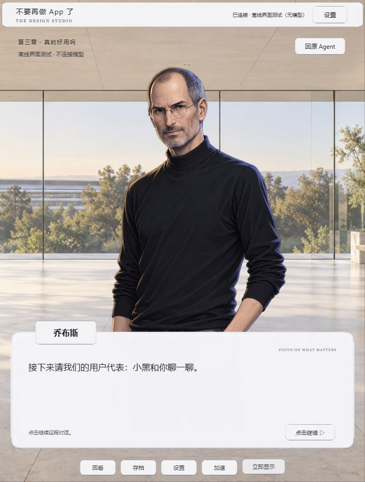
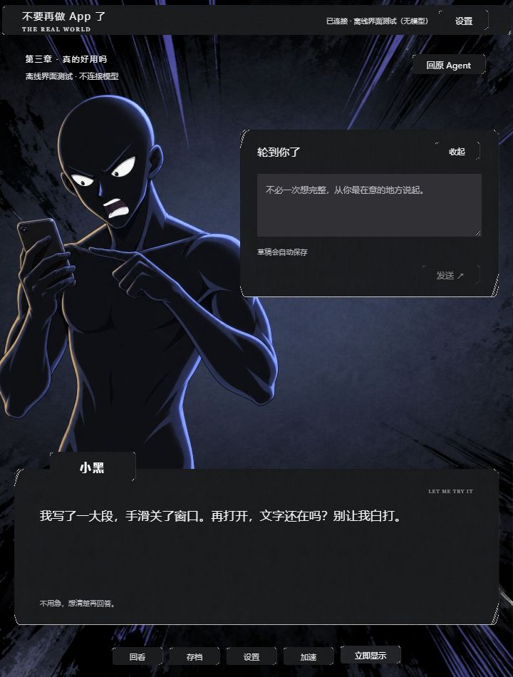

# 人物比例与回复避让修复

2026-09-17。覆盖同日角色主题初版中的人物布局说明。

原因：输入面板出现时，把所有角色的容器同时压窄、压矮，`object-fit: contain` 因而缩小了人物。乔布斯和小黑原图在大腿处截断，缩小后这个边缘暴露在场景中，形成悬空的小立绘。

修复：两人的内置立绘共用 2:3 画布与同一舞台高度，顶部给章节标题留空间，底部落在对话框后。普通对话居中，输入/交付时只向左平移，收起时移回，不改变大小。窄窗口回复面板稍收窄；小于 550px 时保留上方面部并将输入下移。没有重新生成或修改人物图片，原主题、角色职责、剧情与同步逻辑不变。

Windows 浏览器离线夹具实测：

- 720 × 950 下，乔布斯、小黑画布均为 496 × 744px。小黑提问前、输入展开和收起三种状态高度相同；乔布斯也检查过输入展开/收起保持尺寸。
- 人物画布底部为 y=850，对话框底部为 y=894，图像截断位于面板内部，不从底部露出。
- 1440 × 900 宽屏和 500 × 900 窄分栏进行了布局检查，后者保留面部与可滚动回复区。
- 角色交接仍按乔布斯告别 → 小黑登场 → 小黑提问播放。本次只调整 CSS 与文档，不新增模型调用，也不作为宿主同步验证。

