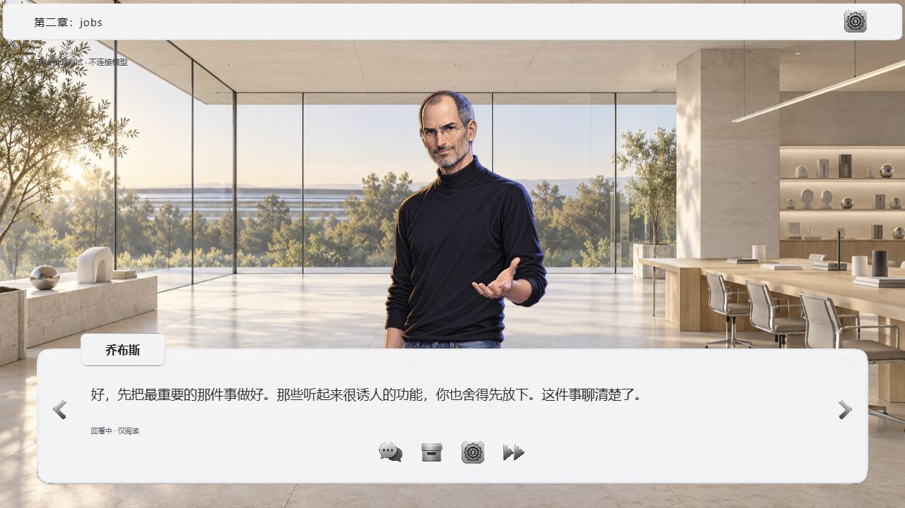
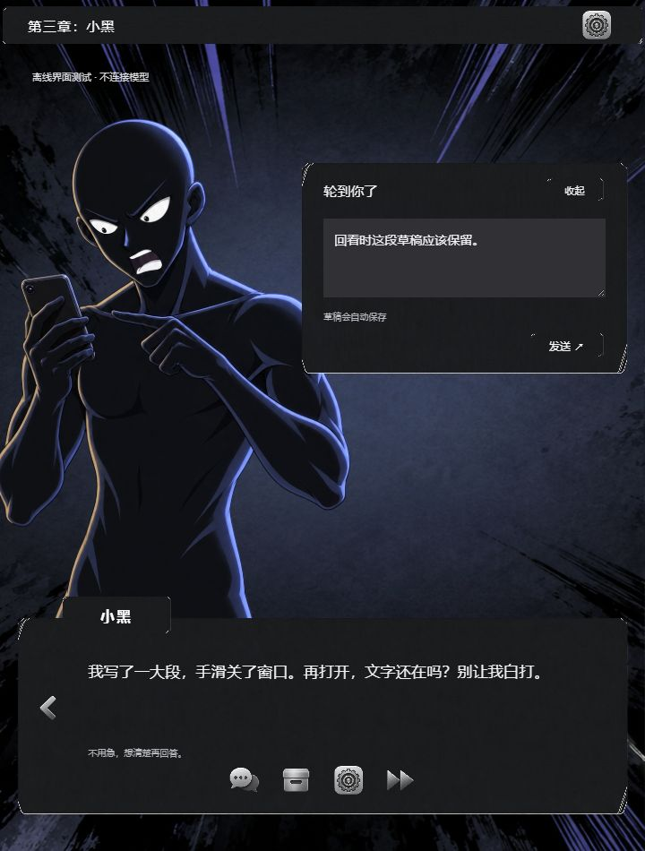

# 章节顶栏与只读台词回放

## 已实现

- 章节移至顶栏：第一章：AI、第二章：jobs、第三章：小黑、第四章：AI。交接期间根据当前说话角色显示章节；用户台词保留此前角色。
- 移除顶栏品牌、可见连接文案、回原 Agent 按钮、英文装饰语、底部键盘提示和「立即显示」按钮。连接异常仍有提示；返回主菜单移至设置内。点击对话框或空格仍可补全当前台词。
- 设置改为生成的苹果系统风格齿轮贴图。回看、存档、设置、加速四个图标居中放入对话框底部，保留名称、悬停提示、键盘焦点与加速状态。
- 左箭头回放上一句，右箭头只在回看过去台词时显示。实际播放进度与临时回看位置分离；回看不保存旧位置、不重复提交、不恢复角色或启动开发。旧提问、错误恢复和交付面板均不能在回看中触发。草稿保留，新增回复不会抢走回看位置。返回实际进度后恢复正常播放与操作。
- 系统、Jobs、小黑共用操作结构，沿用各自场景、皮肤、头像比例与过渡。图标为一张原样保存的透明生成 PNG，通过 CSS 定位显示，未用代码绘制图标；提示词见 `web/assets/midnight/dialogue-icons-prompts.json`。

## 已实测

- TypeScript 检查、构建、59 项自动测试、两份前端脚本语法检查、Skill 校验通过。
- 新增 5 项直接执行生产前端处理函数的回归测试，覆盖历史输入/提交禁用、草稿和实际进度保留、新回复到达、历史错误/文档不触发动作、迟到文档响应、交接章节及退出重置。
- 无模型浏览器夹具实测：系统开场→Jobs 提问→双角色交接→小黑提问→系统交付；上下文和主题跟随回放切换。
- 实际点击回看/前进：右箭头在实际进度隐藏；回看旧问题不出现输入框；回到当前问题后草稿仍在；回复生成期间回看，回复到达后仍停留旧台词；刷新从实际存档位置恢复。
- 交付时回看会隐藏交付操作，返回后可重新打开真实示例 Markdown。未点击开发按钮，没有真实模型提交。
- 1280×720、720×950、500×950 窗口检查；四图标可见，窄窗口无横向溢出，保留角色大尺寸和输入避让。已修正旧样式隐藏窄窗口图标及皮肤边框覆盖图标的问题。浏览器错误日志为空。
- 本地 Codex / WorkBuddy 两份 Skill 已更新；本任务的 Codex 入口已启动新版服务。

## 证据与边界

截图及交互验证均来自标明无模型的离线夹具，不作为新宿主同步认证。未新增真实 Agent 同步测试；macOS、其他宿主和长期运行结论仍沿用已有未验证边界。旧后台进程需要重启，才能注册新增图标文件；单纯刷新旧服务可能找不到图标。重启不删除存档。
