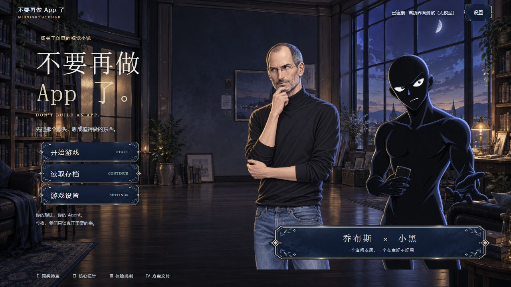
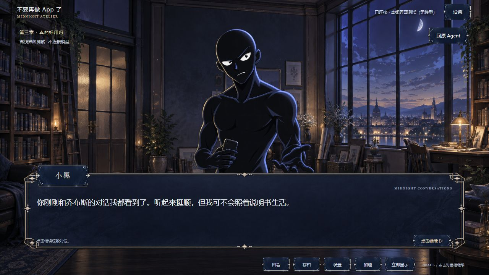
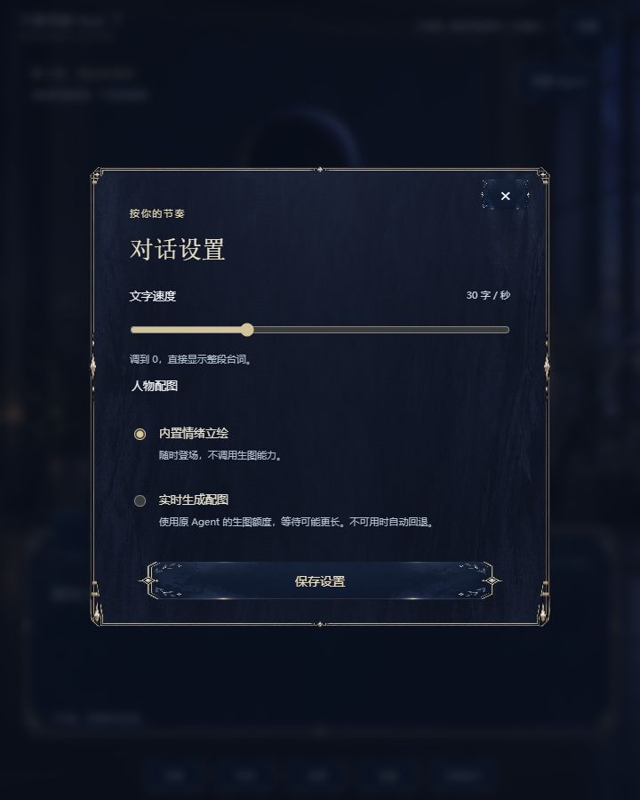
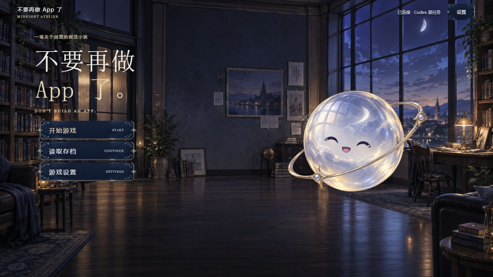

# 夜间创作室 · GalGame 美术与排版

2026-09-17。此版本替换初版的代码绘制占位美术，保留原会话同步、审查流程和结构化剧情协议。

## 参考与取舍

- [CLANNAD 官方介绍页](https://www.prot.co.jp/ps4/clannad/introduction.html)：实际查看游戏截图，参考场景铺满、人物前景、底部宽对话框与白色正文的构图。
- [CLANNAD 官方系统页](https://www.prot.co.jp/ps4/clannad/system.html)：参考居中选择区与独立设置界面。
- [Ren’Py 对话界面文档](https://www.renpy.org/doc/html/dialogue.html)与[特殊界面文档](https://www.renpy.org/doc/html/screen_special.html)：参考姓名、台词、选择和快捷控制的职责分离。

没有使用或下载这些游戏的美术。参考布局规律，背景和界面皮肤重新生成。

## 统一风格

主题为「夜间创作室 / Midnight Atelier」：月光中的工作室与藏书、深蓝玻璃质感、细香槟金边线、月白文字。人物使用较成熟的日系游戏插画，统一右侧蓝色轮廓光和左侧微暖光。

- 主菜单：左侧标题与纵向开始/读档/设置，右侧系统精灵。按用户反馈移除标题下介绍、按钮下文案和底部流程文字。
- 对话：大立绘、底部固定宽文本框、左上姓名牌、最下缘快捷菜单。
- 回复：台词结束后中央弹出输入区，可以收起；桌面和窄分栏下保留人物面部。
- 存档、设置、交付和阅读器：复用生成框体，不另画一套网页卡片。
- 标题用系统宋体类字体，正文用系统黑体类字体。正文是真实 DOM 文字，保留选择、滚动、键盘访问与逐字播放。
- 情绪直接通过人物表情和姿态表现，不在场景旁再贴情绪说明文字。

## 素材清单

全部位于 `web/assets/midnight/`，共 **19 张 PNG，约 26 MB**：

| 类型 | 数量 | 内容 |
| --- | --- | --- |
| 背景 | 1 | 月光工作室，1672 × 941 |
| UI 皮肤 | 2 | 对话框、按钮/姓名牌，2172 × 724，真实透明通道 |
| 乔布斯 | 6 | 平静、思考、质疑、不满、认可、惊讶，1024 × 1536 |
| 小黑 | 6 | 同上，1024 × 1536 |
| 系统精灵 | 4 | 平静、思考、开心、惊讶，1254 × 1254；质疑/不满复用平静 |

完整提示词、生成日期与源文件标识见 [prompts.json](../web/assets/midnight/prompts.json)。背景先生成；UI 皮肤和人物基础立绘以背景为参考；人物变体以各自基础立绘为身份参考；系统思考图以系统平静图为参考。生成结果原样复制，没有用程序重绘、抠图或处理图片。

代码只负责图片加载、缩放、裁切显示、九宫格拉伸和交互布局。所有装饰边框、人物、背景均来自上述生成 PNG；没有 SVG、Canvas 或 CSS 形状绘画。原生输入框、单选按钮、滑块及焦点线属于可操作控件，保留浏览器可访问性。

素材已经随包提供，使用内置模式不会再次生图。可选实时生图沿用原 Agent 的能力和额度，图片不可用时使用这套内置立绘。

## 系统精灵动效

主菜单和对话中的内置系统精灵缓慢上下浮动，位移为 ±4 px、完整周期约 6 秒。点击时交替呈现开心/惊讶表情，轻轻抬起、偏转并恢复；单次反应 1.2 秒，位移过渡 220 ms。连续点击重定向当前反应，不叠加动作或计时器。

表情是以平静图为参考生成的新 PNG，画布、透明通道和构图保持一致。点击不发送聊天、不改变剧情、不调用模型或生图。角色更换时取消尚未完成的表情更新，恢复到当前剧情的原始形象；自定义实时配图不套用本套精灵反应。

鼠标和触屏可以点击；键盘 Enter/空格可换表情。减少动态效果偏好下取消位移和漂浮，保留表情反馈。页面隐藏时暂停浮动。

公开安装默认使用上述 PNG 动效。本地新增了真正的 Cubism 模型试验：分层素材由生图产生，使用官方 Core 和 Framework 在 WebGL 中渲染，支持视线、眨眼和独立嘴部变化。模型不可用时保留原 PNG 动效，设置中可以切换。素材、制作方法和发布边界见 [Live2D 试验说明](../experiments/live2d/README.md)，实测见 [试验记录](reports/2026-09-17-live2d-trial.md)。

## 预览

主菜单截图来自本地运行页面；人物对话与设置截图来自明确标注“无模型”的离线界面样例，不是实际产品审查内容。

